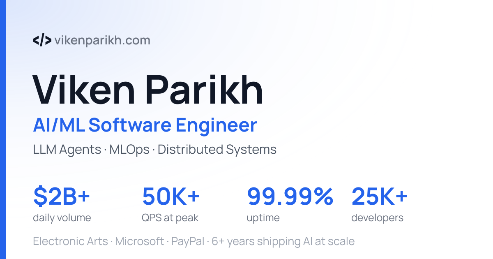

# Viken Parikh — Personal Website

My portfolio at **[vikenparikh.com](https://vikenparikh.com)** — built with Astro and Tailwind CSS v4, deployed to GitHub Pages.



## Tech stack

- **Astro 7** (static output) — **requires Node ≥ 22.12**
- **Tailwind CSS v4**
- TypeScript-driven site config (`src/config.ts`)
- Vitest (component/render + a11y + CI-gate tests) & Playwright (browser E2E) + a small Node contact backend + a Python project-builder script

## Local development

```bash
npm install
npm run dev        # astro dev server
```

## Content

All profile content — headline, skills, experience, education, social links — lives in **`src/config.ts`**. The visible **Projects** section (`src/components/Projects.astro`) is a hand-curated list: a featured trio (edumind-ai, neuralverse-ai, medmind-ai) plus selected other repos.

There is also an optional project generator (`scripts/portfolio_builder.py` → `src/generated/projects.ts`) that scans local/GitHub repos; its output feeds `siteConfig.projects` but is **not** what the Projects section renders. Run it manually if you want to refresh that data:

```bash
npm run sync:projects
```

Configure scanning/curation in `portfolio_builder.json` (`scan_paths`, `exclude_projects`, `preferred_projects`, `max_projects`).

## Social share card

The Open Graph / Twitter card (`public/images/og-card.png`) and `apple-touch-icon.png` are generated from vendored Manrope fonts:

```bash
npm run gen:og     # regenerate after changing headline copy/stats
```

## Testing

```bash
npm test           # Vitest — component/render tests, axe a11y audit, and the CI-gate unit tests
npm run test:py    # Python — portfolio_builder unit tests
cd backend && npm test   # Node --test — contact server (validation, rate-limit, honeypot, CORS)

# Browser E2E (Playwright/Chromium) — defaults to the live site
cd tests/e2e && npm install && npx playwright install chromium && npx playwright test
```

## CI & deployment

Every PR and push to `master` runs the full quality suite before anything merges or deploys.

- **CI** (`.github/workflows/ci.yml`) — three parallel jobs:
  - **frontend** — `astro check`, Vitest, `astro build`, then browser-free gates on the built `dist/`:
    - `check-links --assets-only` — every self-hosted asset/route reference resolves
    - `audit-html` — structural HTML/a11y/SEO rules (heading outline, alt text, canonical, in-page anchors, `target=_blank` safety, …)
    - `check-jsonld` — JSON-LD structured data is valid + carries its schema.org rich-result fields
    - `check-rss` — the hand-templated RSS feed is well-formed (required elements, valid dates, no unescaped `&`)
    - `check-weight` — performance byte budget per page / bundle / image
  - **contact backend** — `node --test`
  - **portfolio builder** — Python unit tests
- **Browser E2E** (`.github/workflows/playwright-e2e.yml`) — Playwright/Chromium smoke tests + an axe **color-contrast** audit (the layout-dependent rule the jsdom suite can't run). On PRs/pushes it builds the revision and tests it via a local preview server; on a daily schedule it monitors the live site.
- **Deploy** (`.github/workflows/deploy.yml`) — builds and publishes `dist/` to GitHub Pages on push to `master`.
- **Weekly link check** (`.github/workflows/link-check.yml`) — full external-link sweep (Mondays).
- All Node workflows run on **Node 22** (Astro requires Node ≥ 22.12; Node 20 fails the build).

## Production build

```bash
npm run build      # runs sync:projects, then astro build → dist/
# or, without the project re-scan:
npx astro build
```
